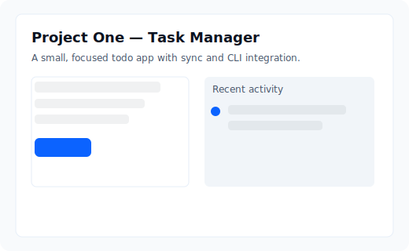
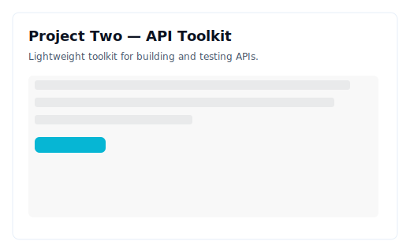
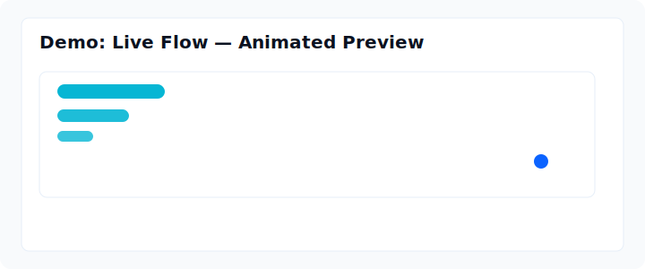

<!--
	Professional GitHub profile README for `kelvintawe12`.
	Update the social handles and project links below to match your profile.
-->

	

# Hi — I'm Kelvintawe 👋

> Developer • Open-source enthusiast • Cloud & automation learner

	
	
	
	

	
	

---

## About me

I build reliable, maintainable applications with a focus on developer experience and automation. I enjoy building full-stack features, writing tools to speed up common tasks, and learning about cloud-native systems.

**Areas I work in:** Backend APIs, CLI tools, automation (CI/CD), serverless functions, and developer tooling.

<!--LAST_UPDATED--><!--END_LAST_UPDATED-->

---

## Tech stack & tools

- **Languages:** JavaScript / TypeScript, Python
- **Frameworks:** Node.js, Express, React (basic)
- **DevOps & infra:** GitHub Actions, Docker, Git
- **Datastores:** SQLite / PostgreSQL

	
	
	
	
	

---

## Featured projects

<!--PINNED_REPOS-->
<!--END_PINNED_REPOS-->

Below are a few highlighted repos — click to explore, star, or contribute.

<table>
	<tr>
		<td align="center" width="33%">
			
			
<strong>Project One</strong> Task manager & CLI sync • <a href="https://github.com/kelvintawe12/project-1">Repo</a>

		</td>
		<td align="center" width="33%">
			
			
<strong>Project Two</strong> API toolkit & testing helpers • <a href="https://github.com/kelvintawe12/project-2">Repo</a>

		</td>
		<td align="center" width="33%">
			
			
<strong>Project Three</strong> Live demo / workflow • <a href="https://github.com/kelvintawe12/project-3">Repo</a>

		</td>
	</tr>
</table>

---

## What I'm learning

- Cloud-native patterns (serverless, observability)
- Production-grade CI/CD and testing strategies
- Systems design and scalable architectures

---

## Get in touch

- Email: your.email@example.com
- LinkedIn: https://www.linkedin.com/in/your-linkedin
- Twitter: https://twitter.com/your_twitter

	

---

If you'd like, I can:

- Add personalized project screenshots and GIFs
- Improve the visual layout and CSS (GitHub Pages)
- Auto-populate featured projects (I already added a generator workflow)

Thanks for visiting — if you want me to customize text, add exact social links, or add screenshots/GIFs, send them and I'll update the README.
# Hi, I'm Kelvintawe 👋

Developer • Learner • Open-source enthusiast

I'm a software developer building things with JavaScript, Python, and cloud tech. I enjoy solving problems, learning new tools, and sharing knowledge through code.

**Featured Projects**
<!--PINNED_REPOS-->
<!--END_PINNED_REPOS-->

# Hi, I'm Kelvintawe 👋

Developer • Learner • Open-source enthusiast

I'm a software developer building things with JavaScript, Python, and cloud tech. I enjoy solving problems, learning new tools, and sharing knowledge through code.

<!--BADGES-->

<!--END_BADGES-->

<!--LAST_UPDATED--><!--END_LAST_UPDATED-->